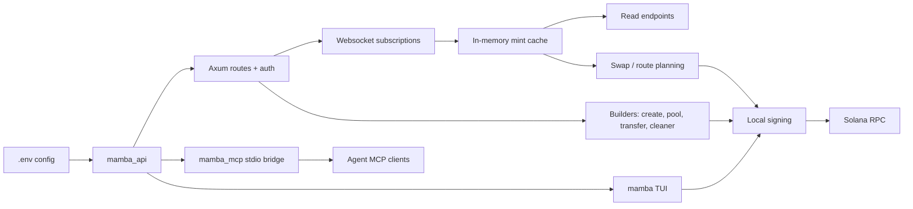

# Architecture

## Runtime model

Mamba is a single Rust crate with four user-facing binaries and a set of protocol adapters underneath.

| Binary | Source | What it does |
|--------|--------|-------------|
| `mamba_api` | `src/bin/mamba_api.rs` | Authenticated Axum backend via `mamba::api::run_from_env()` |
| `mamba_mcp` | `src/bin/mamba_mcp.rs` | Stdio MCP bridge that proxies agent requests to the local API |
| `mamba` | `src/bin/mamba.rs` | Terminal app for trading, wallet ops, token creation, pool management |
| `mamba_tx_inspect` | `src/bin/mamba_tx_inspect.rs` | Reads a base64 transaction and verifies signer assumptions |

## Data flow

1. `mamba_api` loads environment and starts authenticated routes.
2. Websocket subscriptions populate runtime market caches through `src/handlers/ws.rs`.
3. Read endpoints resolve mints, routes, creators, and metadata from the live cache. When `MAMBA_API_STORE_MODE=true`, Postgres-backed overlays add historical depth.
4. Builder endpoints return unsigned transactions with optional simulation results.
5. `mamba_mcp` forwards the same API surface to MCP clients without exposing private keys.
6. `mamba` consumes builders, signs locally when required, and can render deterministic snapshots for UI evidence.

## Crate layout

| Module | Path | Role |
|--------|------|------|
| API | `src/api/` | Axum routes, auth, docs, websocket cache views, store-backed endpoints, wallet/create/pool handlers |
| MCP | `src/mcp/` | Stdio MCP server with tool definitions wrapping the HTTP API |
| Core | `src/core/` | Shared Solana utilities, create/pool/wallet builders, signer helpers, cluster handling |
| DEX | `src/dex/` | Market-specific integrations, route selection, swap orchestration |
| Handlers | `src/handlers/` | Websocket ingestion and live mint cache plumbing |
| SWQoS | `src/swqos/` | Provider-specific transport and relay settings (Jito, Helius, Blox, NextBlock, Temporal, ZeroSlot) |
| Transfers | `src/transfers/` | SOL, WSOL, and transfer helpers |
| Compute budget | `src/compute_budget/` | Compute-unit policy utilities |
| Gate | `src/gate/` | Auth middleware and rate limiting |
| Utils | `src/utils/` | File-writing and general helpers |
| IDLs | `src/idls/` | Typed protocol crates and checked-in JSON IDLs |

## Wallet surfaces

Wallet operations split into two tracks:

**Transfer builder** moves SOL or SPL assets between locally managed wallets. Logic lives in `src/core/wallet.rs`, HTTP routes in `src/api/wallet.rs`.

**Cleaner builder** inspects token accounts, unwraps WSOL, closes empty accounts, and optionally burns non-zero balances before closing. Same code locations, plus the TUI Cleaner screen in `src/bin/mamba.rs`.

## External sources

| Path | Purpose |
|------|---------|
| `scripts/sync_sources.sh` | Refreshes protocol references into `external/upstreams/` |
| `UPSTREAM_SOURCES.lock` | Records branch and commit state for synced references |
| `external/patches/anchor-idl/` | Checked-in local patch for the `anchor-idl` dependency |

## Evidence strategy

The repo keeps code and docs in-tree while ignoring local validation output:

| Path | Role |
|------|------|
| `docs-site/` | Generated MkDocs output for local preview or static hosting |
| `artifacts/` | Local workspace for API checks, CLI snapshots, and validation runs |
| `.env` | Private configuration, never committed |
